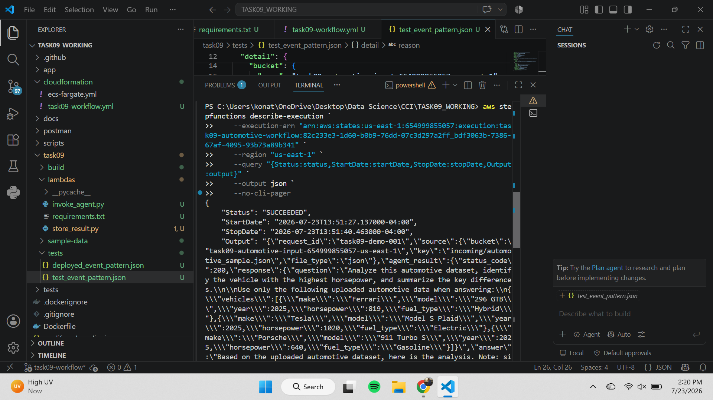
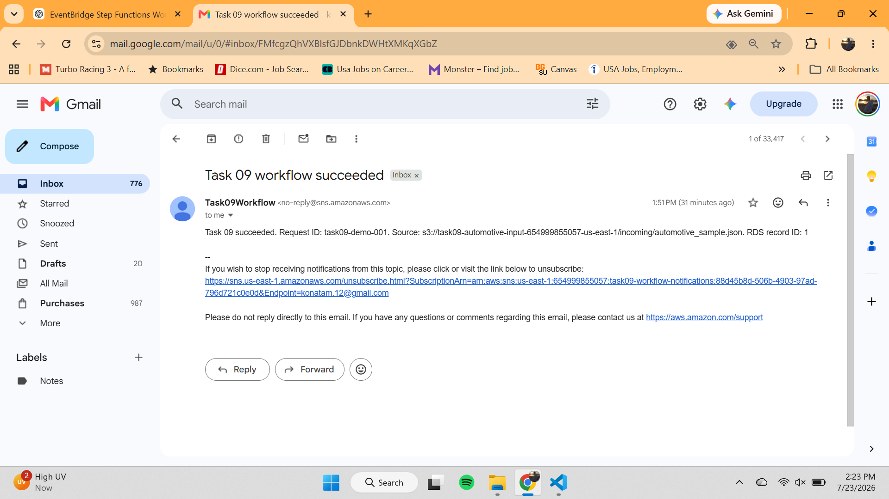
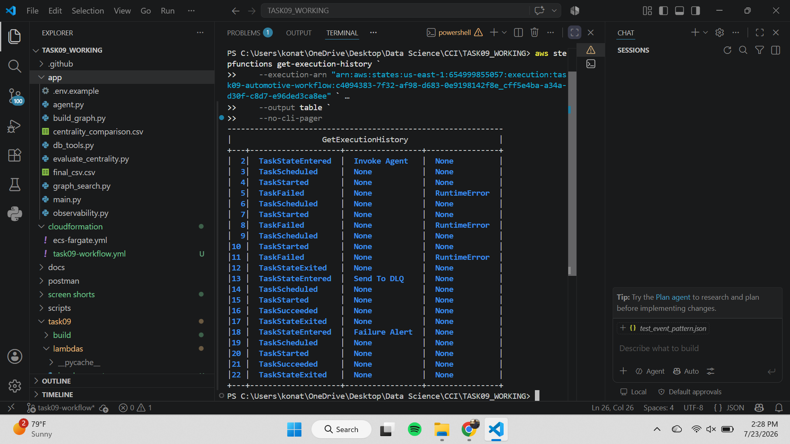
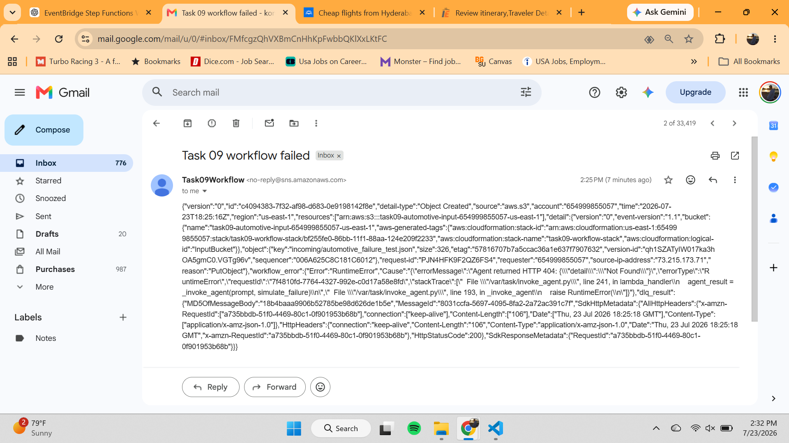
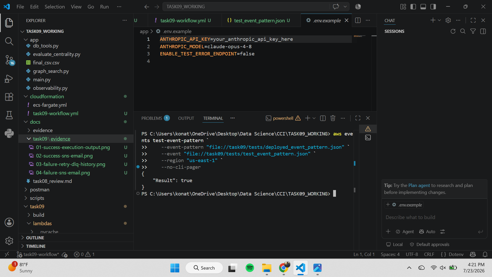

# Task 09 — End-to-End Workflow with EventBridge and Step Functions

## Project Summary

Task 09 implements a fully automated, event-driven automotive data-processing workflow on AWS.

When a JSON or CSV file is uploaded to the configured Amazon S3 prefix, Amazon EventBridge automatically starts an AWS Step Functions state machine. The workflow reads the uploaded data, invokes the existing automotive AI agent, stores the processed result in Amazon RDS for PostgreSQL, and sends a notification through Amazon SNS.

The workflow also includes retry handling, an Amazon SQS dead-letter queue, failure notifications, CloudWatch logging, IAM roles, and private database networking.

## Workflow Status

| Requirement | Status |
|---|---|
| S3 file upload trigger | Completed |
| EventBridge filtering for JSON and CSV | Completed |
| Step Functions orchestration | Completed |
| Existing automotive agent integration | Completed |
| Result storage in RDS PostgreSQL | Completed |
| SNS success notification | Completed |
| Two agent-call retries | Completed |
| SQS dead-letter queue | Completed |
| SNS failure notification | Completed |
| Manual EventBridge rule test | Passed |
| Automated success-path test | Passed |
| Automated failure-path test | Passed |

## Architecture Flow

### Success Path

1. A user uploads an automotive `.json` or `.csv` file to the `incoming/` prefix in Amazon S3.
2. Amazon S3 publishes an Object Created event to Amazon EventBridge.
3. The EventBridge rule filters the object key and starts the Step Functions state machine.
4. The **Invoke Agent** state calls the Invoke Agent Lambda function.
5. The Lambda function reads and validates the uploaded file.
6. The Lambda function sends the automotive data to the existing HTTPS agent endpoint.
7. The existing ECS Fargate automotive agent processes the data and returns its analysis.
8. The **Store Result** state calls the Store Result Lambda function.
9. The Store Result Lambda retrieves the database credentials from AWS Secrets Manager.
10. The processed result is stored in Amazon RDS for PostgreSQL.
11. The **Notify** state publishes a success message through Amazon SNS.
12. The subscribed user receives a success email.

### Failure Path

1. If the agent invocation fails, Step Functions retries the operation twice.
2. Retry attempts use exponential backoff.
3. If all attempts fail, the original event and workflow error are sent to the Amazon SQS dead-letter queue.
4. Step Functions publishes a failure alert through Amazon SNS.
5. The workflow terminates in the **Workflow Failed** state.

## Deployed AWS Resources

| Resource | Value |
|---|---|
| AWS Region | `us-east-1` |
| CloudFormation Stack | `task09-workflow-stack` |
| Input Bucket | `task09-automotive-input-654999855057-us-east-1` |
| Monitored Prefix | `incoming/` |
| EventBridge Rule | `task09-s3-object-created` |
| Step Functions State Machine | `task09-automotive-workflow` |
| Invoke Agent Lambda | `task09-invoke-agent` |
| Store Result Lambda | `task09-store-result` |
| RDS Engine | PostgreSQL |
| Database Name | `automotiveworkflow` |
| Database Table | `workflow_results` |
| SNS Topic | `task09-workflow-notifications` |
| SQS Dead-Letter Queue | `task09-workflow-dlq` |
| Agent Endpoint | `https://testagent.cciplatform-ai.com/query` |

## EventBridge Filtering

The EventBridge rule only starts the workflow when an object:

- Is uploaded to the Task 09 input bucket
- Is located under the `incoming/` prefix
- Has a `.json` or `.csv` extension

Files uploaded outside the monitored prefix or with unsupported extensions do not start the workflow.

## Step Functions State Machine

The Amazon States Language definition is embedded in:

```text
cloudformation/task09-workflow.yml
```

The primary success states are:

1. `Invoke Agent`
2. `Store Result`
3. `Notify`

The error-handling states are:

1. `Send To DLQ`
2. `Failure Alert`
3. `Workflow Failed`

The Invoke Agent state is configured to retry a failed agent call two times before entering the failure path.

## Lambda Functions

### Invoke Agent Lambda

File:

```text
task09/lambdas/invoke_agent.py
```

Responsibilities:

- Receives the EventBridge S3 event
- Validates the bucket, prefix, extension, and file size
- Reads JSON or CSV automotive data from S3
- Builds the agent request
- Calls the existing HTTPS automotive agent
- Returns the agent analysis to Step Functions
- Supports controlled failure testing when explicitly enabled

### Store Result Lambda

File:

```text
task09/lambdas/store_result.py
```

Responsibilities:

- Receives the agent result from Step Functions
- Retrieves PostgreSQL credentials from AWS Secrets Manager
- Connects to the private RDS database
- Creates the `workflow_results` table when necessary
- Stores or updates the result using `request_id`
- Returns the stored database record ID

The Lambda deployment package uses:

```text
pg8000==1.31.5
```

## Manual EventBridge Test

The deployed EventBridge pattern was tested before the end-to-end upload:

```powershell
aws events test-event-pattern `
    --event-pattern "file://task09/tests/deployed_event_pattern.json" `
    --event "file://task09/tests/test_event_pattern.json" `
    --region "us-east-1" `
    --no-cli-pager
```

Result:

```json
{
    "Result": true
}
```

This confirmed that the test S3 Object Created event matched the deployed rule.

## Successful End-to-End Test

The sample automotive data file was uploaded using:

```powershell
aws s3 cp `
    ".\task09\sample-data\automotive_sample.json" `
    "s3://task09-automotive-input-654999855057-us-east-1/incoming/automotive_sample.json" `
    --region "us-east-1" `
    --no-progress
```

The upload automatically triggered the workflow without manually starting Step Functions.

### Successful Result

- Workflow status: `SUCCEEDED`
- Request ID: `task09-demo-001`
- Agent HTTP status: `200`
- Highest-horsepower vehicle identified: Tesla Model S Plaid
- Horsepower: `1,020`
- Result stored in the `workflow_results` RDS table
- RDS record ID: `1`
- SNS success notification delivered

## Failure-Path Test

A controlled failure test was performed using:

```text
task09/sample-data/automotive_failure_test.json
```

The test was temporarily enabled through the CloudFormation parameter:

```text
EnableFailureTest=true
```

The failure-test file was uploaded to:

```text
s3://task09-automotive-input-654999855057-us-east-1/incoming/automotive_failure_test.json
```

### Verified Failure Behavior

The Step Functions execution history showed:

- Initial Invoke Agent attempt failed
- First retry failed
- Second retry failed
- Failed event sent to the SQS dead-letter queue
- SNS failure alert published
- Workflow ended with `FAILED` status

The SQS message contained:

- Original S3 Object Created event
- Uploaded failure-test object key
- Workflow error type
- Lambda error message
- Agent HTTP failure information

After testing, controlled failure mode was disabled again:

```text
EnableFailureTest=false
```

## Evidence

### Successful Execution Output



### SNS Success Notification



### Retry and Dead-Letter Queue History



### SNS Failure Notification



### Manual EventBridge Pattern Test



## Security Controls

The workflow uses the following security controls:

- Least-privilege IAM roles for EventBridge, Step Functions, and Lambda
- RDS PostgreSQL deployed without public access
- Store Result Lambda deployed in private subnets
- Database credentials stored in AWS Secrets Manager
- Encrypted S3 storage
- Encrypted SQS dead-letter queue
- HTTPS communication with the existing automotive agent
- CloudWatch logging for Step Functions and Lambda
- No API keys or database passwords stored in the repository

## Repository Files

```text
cloudformation/
└── task09-workflow.yml

task09/
├── lambdas/
│   ├── invoke_agent.py
│   ├── store_result.py
│   └── requirements.txt
├── sample-data/
│   ├── automotive_sample.json
│   ├── automotive_sample.csv
│   └── automotive_failure_test.json
└── tests/
    ├── deployed_event_pattern.json
    └── test_event_pattern.json

docs/task09/
├── TASK09_GUIDE.md
├── task09-architecture.drawio
├── task09-architecture.png
└── evidence/
    ├── 01-success-execution-output.png
    ├── 02-success-sns-email.png
    ├── 03-failure-retry-dlq-history.png
    ├── 04-failure-sns-email.png
    └── 05-eventbridge-pattern-test.png
```

The generated Lambda ZIP packages under `task09/build/` are excluded from version control.

## Demonstration Video

The final demonstration video must be no longer than five minutes and should show:

1. The architecture diagram
2. The S3 input bucket and `incoming/` prefix
3. Uploading the sample automotive JSON file
4. The automatically started Step Functions execution
5. The successful agent result
6. The RDS record confirmation
7. The SNS success email
8. The previously captured retry, DLQ, and failure-notification evidence

## Conclusion

Task 09 successfully connects Amazon S3, Amazon EventBridge, AWS Step Functions, AWS Lambda, the existing ECS Fargate automotive agent, Amazon RDS for PostgreSQL, Amazon SNS, Amazon SQS, AWS Secrets Manager, and Amazon CloudWatch into a fully automated event-driven workflow.

Both the success path and the controlled failure path were tested successfully. The final deployed workflow processes supported automotive data files without manual intervention, persists the processed result, sends notifications, and safely handles repeated agent failures.